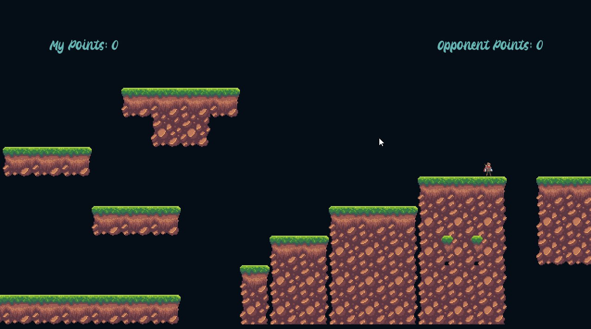
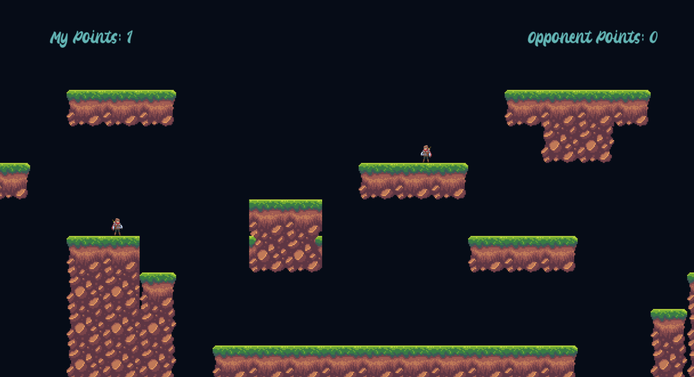
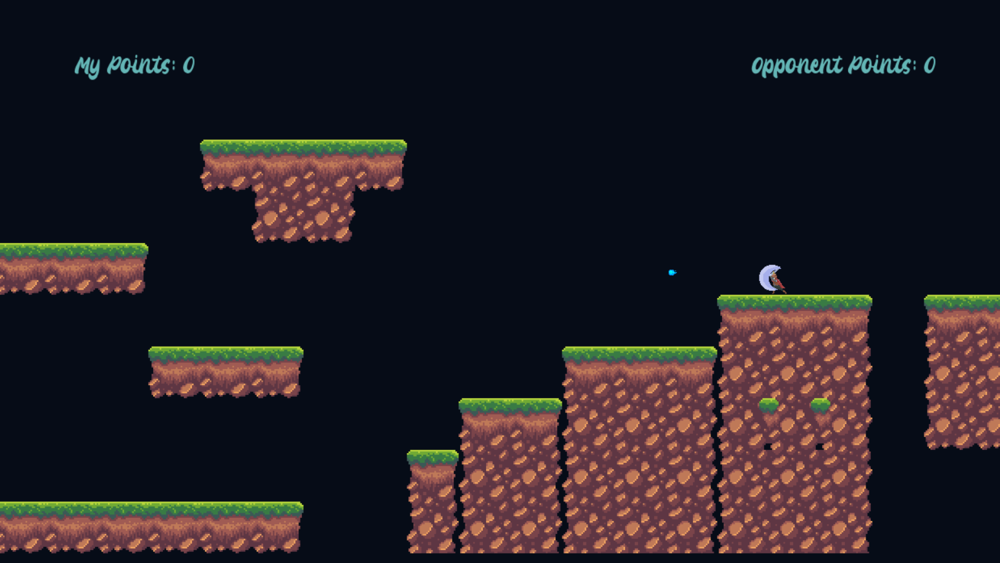
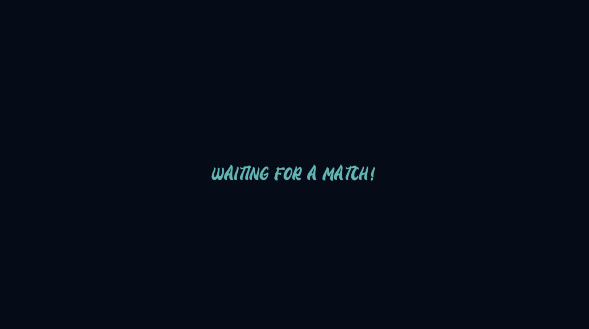
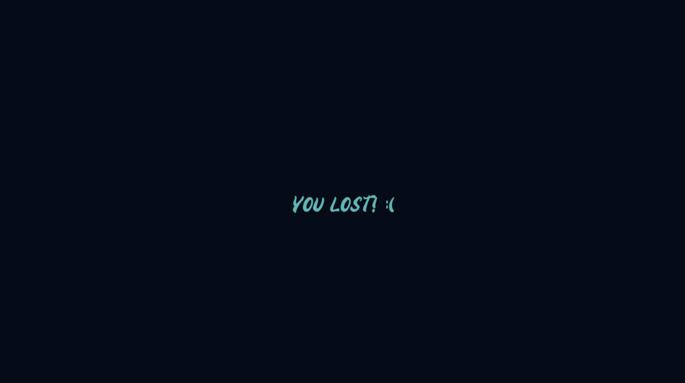

# Unbreakable_PVP

A Platform Shooter Game made with Python using the Pygame library.

## Table of contents
- **[Project Infos](#project-infos)**
- **[Usage](#usage)**
- **[Screenshots](#screenshots)**
- **[Disclaimer](#disclaimer)**

## Project Infos
* **Date:** February 2022
* **Project idea:** Have fun and code with python once again.
* **Game objective:** Kill your opponent until you reach the goal score. :gun:
* **Instructions:** Use the **A**, **D** or **Arrows** keys to move the player and **W**/**SPACE** to jump. Use the **mouse click** to shoot.

## Usage
#### 1. Clone the repo and start the server:
```
$ pyhton server.py
```
#### 2. Start a client on your machine && on your friends machine:
```
$ pyhton client.py
```
#### 3. Once connected have fun and may the best player win.

## Screenshots
* Game Gif


* Game



* Start Menu


* Win Menu


* Lost Menu


## Disclaimer
This repository corresponds to a personal project. I do not take any responsibility over any code faults and do not take any credit for the sprites and sounds displayed throughout the game.
